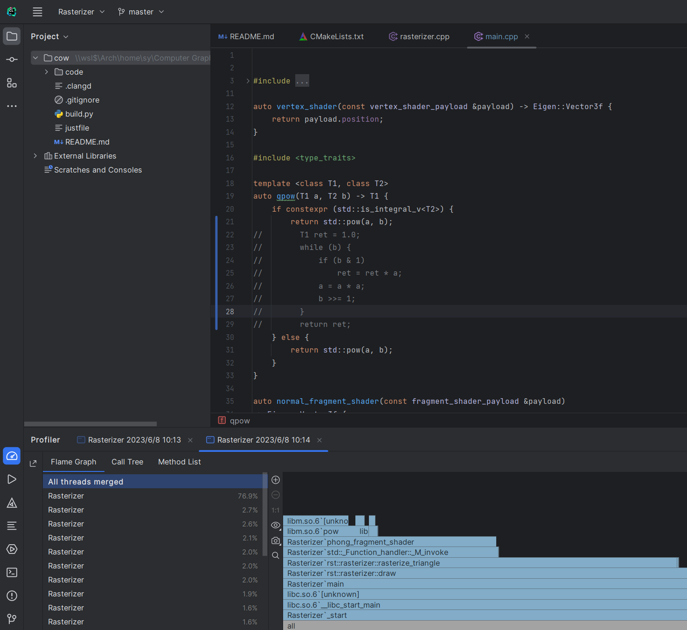
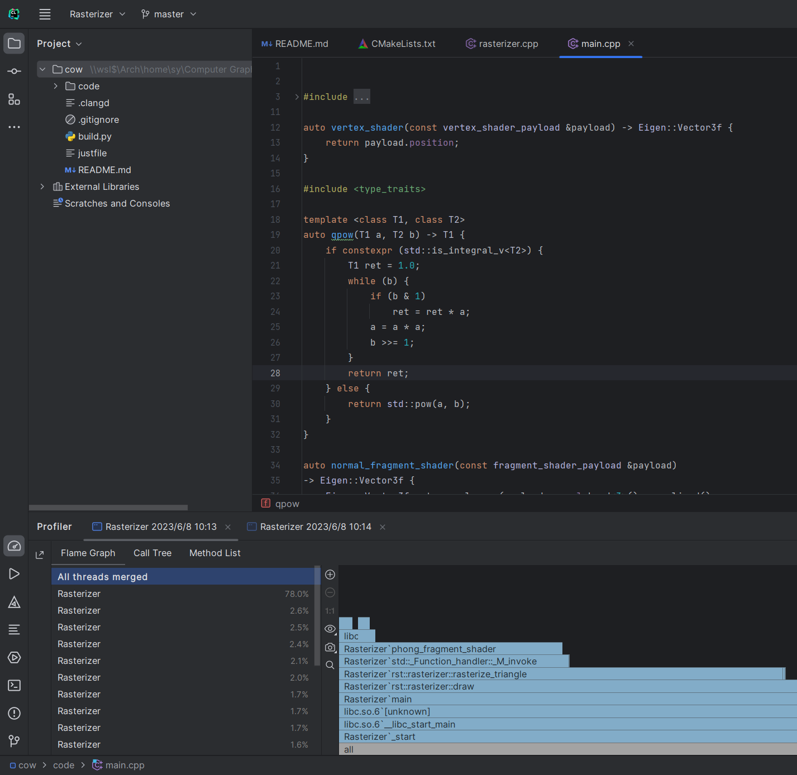

# GAMES101 自学

本项目主要记录 games101 课程的学习过程，但并**不是作业代码**，而是课程主要项目的整理，包括项目代码改写，代码优化等

我会试图用更新的更合适的 C++ 语法来完成项目。受算法竞赛的影响，我会尽可能要求自己的代码运行的快，会使用 perf 等工具，分析代码性能，尽可能从算法层面优化代码。 

即使是对 `Blinn-Phong` 模型中的 `Specular Term` 的幂次处理过程做小小的优化，性能也会有不小的改变。

