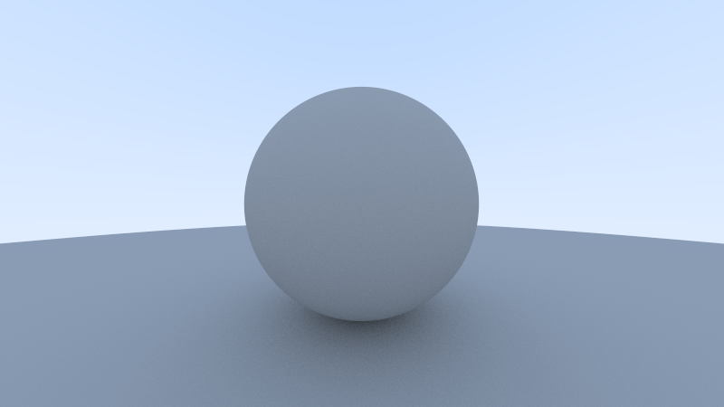

# Ray Tracing V1

本项目是 [Ray Tracing in One Weekend](https://raytracing.github.io/books/RayTracingInOneWeekend.html#diffusematerials/fixingshadowacne) 的学习记录，大致顺序按照书本，但是会有细微变化。

## 准备

与书中使用的 `PPM` 格式不同，本项目使用 `BMP` 格式（代码详细见 `BMP.hpp` 文件），有一下几个原因
1.  `PPM` 格式打开有些慢
2.  书本使用重定向命令将输出到文件，这也比较慢，并且如果想在程序中输出些调试信息也不方便

打算使用进度条，由于本项目最后的程序需要运行很久，所有加了进度条显示进度（代码详见 `global.hpp` 文件）


项目使用 cmake 工具，提供了 `build py` 脚本，默认开启 `release`
```shell
$ python build.py [argvs] # 支持任意数量参数，会嵌入最后可执行文件后
```
还有 `justfile` 工具
```shell
just fmt # 格式化
just clean # 清空 build 文件夹
just build # 编译运行
just move # 讲生成的图片移到 images 文件夹
```
测试运行第一份代码
```cpp
#include "BMP.hpp"
#include "global.hpp"
auto main() -> int {
  // Image
  const int image_width = 256;
  const int image_height = 256;

  // Render
  bmp::bitmap photo(image_width, image_height);
  for (int j = 0; j < image_height; ++j) {
    for (int i = 0; i < image_width; ++i) {
      auto r = double(i) / (image_width - 1);
      auto g = double(j) / (image_height - 1);
      auto b = 0.25;
      photo.set(i, j, {r, g, b});
    }
    UpdateProgress(j, image_height - 1);
  }
  photo.generate("image1.bmp");

  return 0;
}
```
如图所示


## 路径追踪

### 封装 Vec3d 类

与原文不同，多加了字母 `d` 代表 `double` 以表示存储的变量类型。
既可以用来表示点，又可以用来表示颜色

### 封装射线类

把射线看作一个函数, A 是原点，B 是射线方向

$$
P(t) = A + t \cdot B (t \ge 0)
$$

将摄像机放在坐标原点，向 -z 方向看，y 轴朝上，z 轴朝右，从左下角（书上说左上角，但是实际上是左下角，这与 bmp 格式非常符合）开始遍历像素，从原点作为光线原点，向像素点方向发出射线，得到返回值。

单线性插值

$$
lerp = (1 - t) \cdot startValue + t \cdot endValue (0.0 \leqslant t \leqslant 1.0)
$$


### 球体

光线 $(\mathbf{O}, \mathbf{D})$ 与球体 $(C_x, C_y, C_z)$ 半径 $r$ 的交, 光线上有一点 $P = O + tD$ 与球相交

$$
\begin{aligned}
  (P_x-C_x)^2 + (P_y-C_y)^2 + (P_z-C_z)^2 = r^2 \\
  (\mathbf{P} - \mathbf{C})^2 = r^2 \\
  (\mathbf{O} + t\mathbf{D} - \mathbf{C})^2 = r^2 \\
  \mathbf{D}^2 \cdot \mathbf{t} + 2 \mathbf{D}\cdot (\mathbf{A} - \mathbf{C}) + (\mathbf{A} - \mathbf{C})^2 = r^2
\end{aligned}
$$

所以求管线与圆的焦点就是求解一元二次方程，用求根公式即可

```cpp
inline auto solveQuadratic(const double &a, const double &b, const double &c, double &x0, double &x1) -> bool {
  double discr = b * b - 4 * a * c;
  if (discr < 0)
    return false;
  else if (discr == 0)
    x0 = x1 = -0.5 * b / a;
  else {
    double q = (b > 0) ? -0.5 * (b + std::sqrt(discr)) : -0.5 * (b - std::sqrt(discr));
    x0 = q / a, x1 = c / q;
  }
  if (x0 > x1)
    std::swap(x0, x1);
  return true;
}
```


### 表面法线（surface normals）

一般来说，是球心指向表面一点的单位向量就是该点的法线，用一些方法让单位法线显示出来


### 优化求根公式

令 $b = 2h$

$$
x = \dfrac{-h \pm \sqrt{h^2 - ac}}{a}
$$

这个 `half_b` 在加上韦达定理确实可以减少开销。

```cpp
inline auto solveQuadratic_halfb(const double &a, const double &half_b, 
              const double &c, double &x0, double &x1) -> bool {
  double discr = half_b * half_b - a * c;
  if (discr < 0)
    return false;
  else if (discr == 0)
    x0 = x1 = -half_b / a;
  else {
    double q = -half_b + std::sqrt(discr);
    x0 = q / a; x1 = c / q;
  }
  if (x0 > x1)
    std::swap(x0, x1);
  return true;
}
```

### 法线的朝向

在 hit_record 中，光线与球面的交点的法线是始终向外的，因为法线是 $(Point - Center)$ 得到的。

如果所有的法线都是朝外的，这样就可以通过和光线的点积判断，光线是否在球的内部。

### 漫反射材料

表面越深，光被吸收的可能性越大，反射方向是随机的。

随机方法：在于球面交点的法线方向做一个于球面相切的单位圆，然后在单位圆内随机一点，作为反射光的方向。

限制递归层数，后递归求解。

由于这里的计算量比较大，所有启用了多线程，同时也加大了图片尺寸和单像素采样数，以达到更好的采样效果

以下是几种漫反射





### 材质

封装材料类


加上模糊系数后


### 聂耳定律

折射定律，其中是 $\theta$ 光线与法线的夹角，$\eta$ 是折射率 (空气 1.0，玻璃 1.3 - 1.7，砖石 2.4)

$$
 \eta \sin{\theta} = \eta' \sin{\theta}'
$$

为了求解折射光线的方向

$$
 \sin{\theta}' = \dfrac{\eta}{\eta'} \sin{\theta}
$$

### 摄像机

主要是决定发出光线的方向

透镜可以产生一些景深感，其实就是在光圈内容随机光线，使得焦点位置比较清晰


