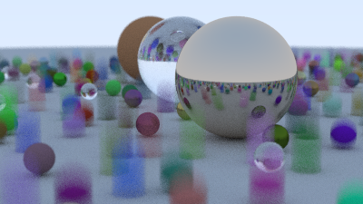
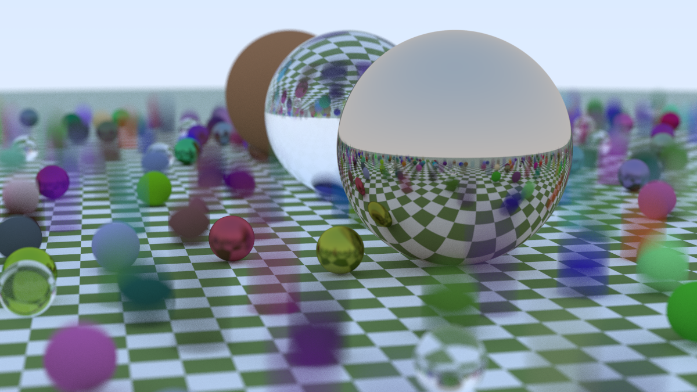
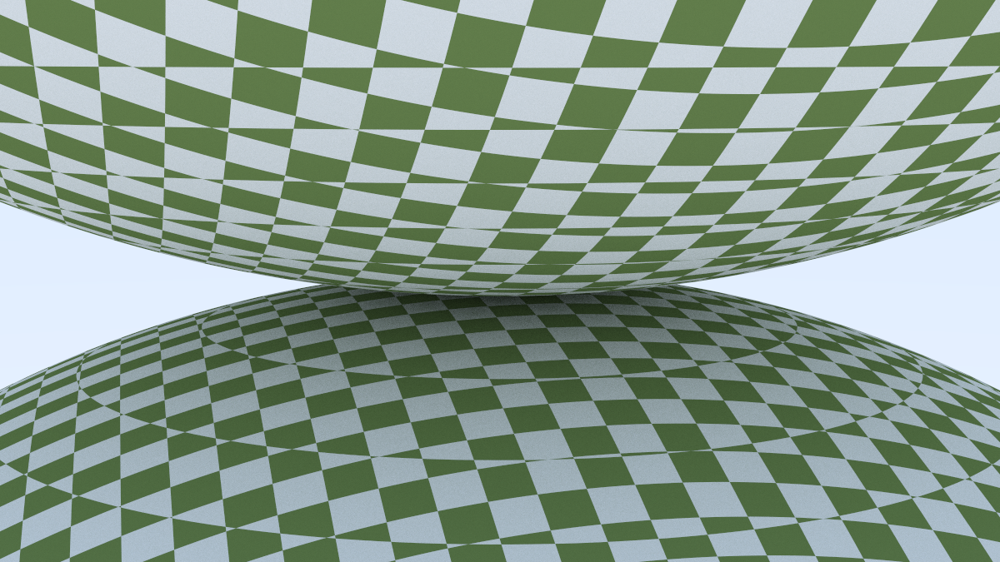
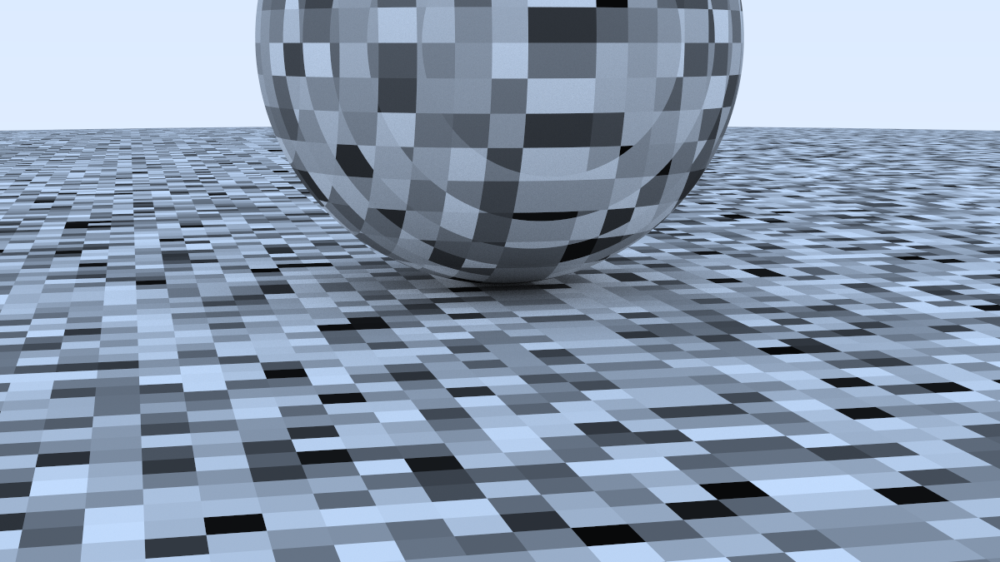
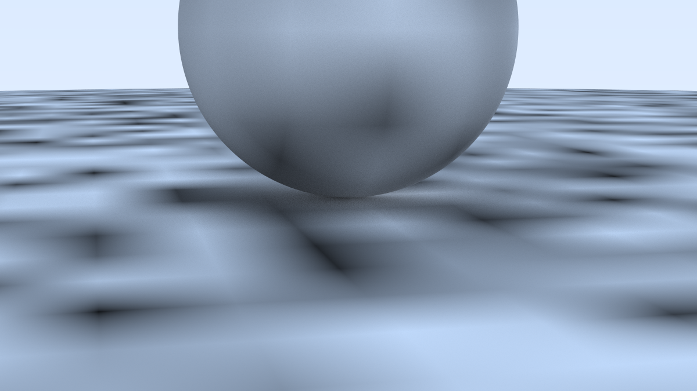
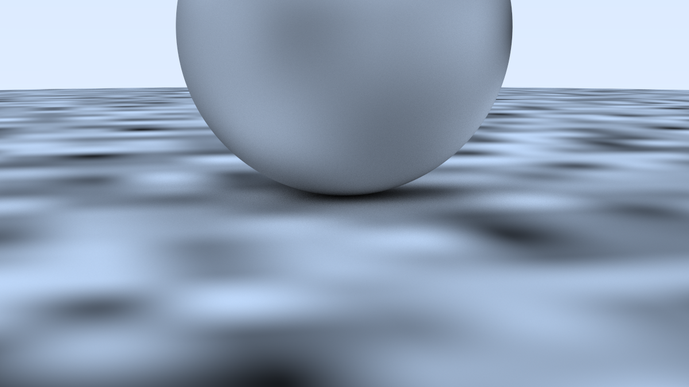
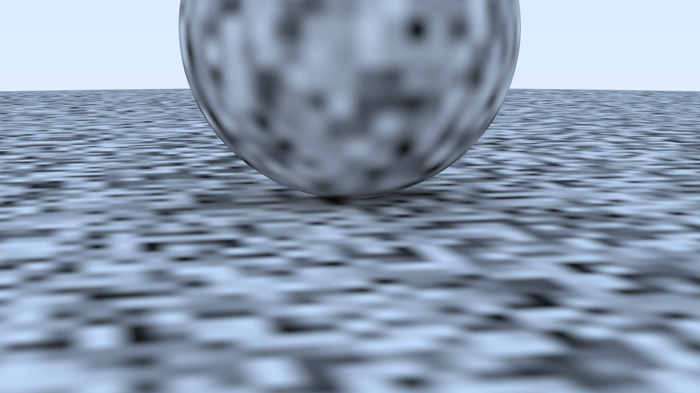
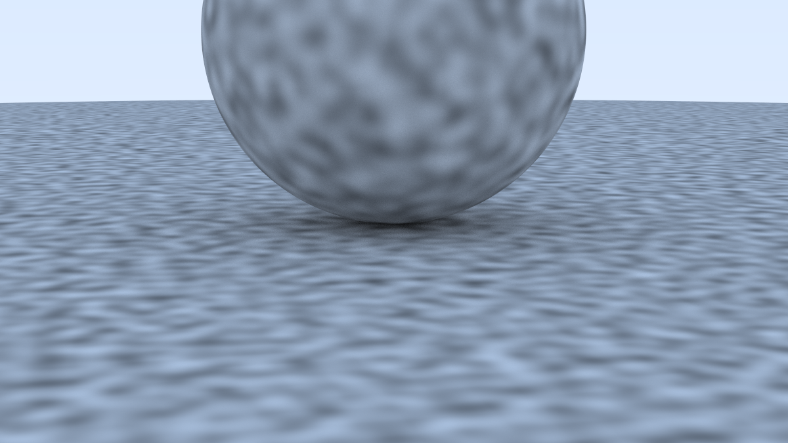
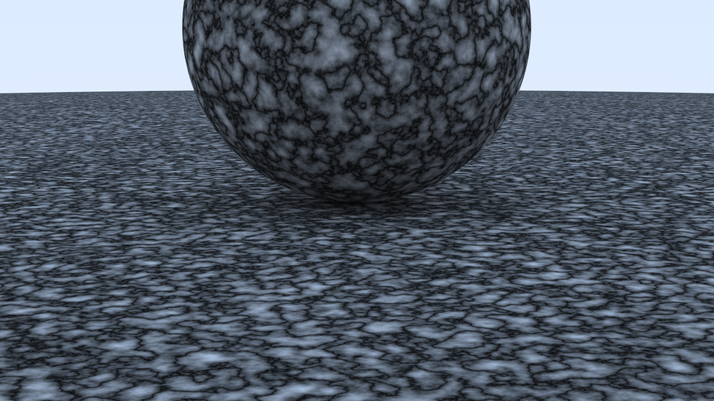
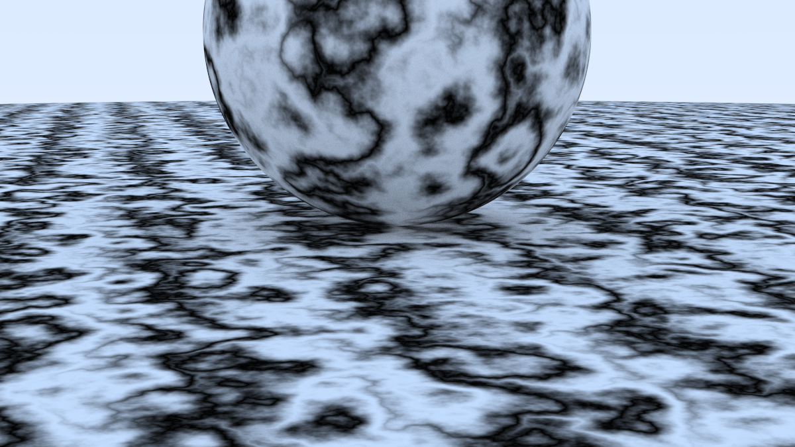

# Ray Tracing V2

本项目是 [Ray Tracing: The Next Week](https://raytracing.github.io/books/RayTracingTheNextWeek.html) 的学习记录，大致顺序按照书本，但是会有细微变化。

## 准备

与书中使用的 `PPM` 格式不同，本项目使用 `BMP` 格式（代码详细见 `BMP.hpp` 文件），有一下几个原因
1.  `PPM` 格式打开有些慢
2.  书本使用重定向命令将输出到文件，这也比较慢，并且如果想在程序中输出些调试信息也不方便

打算使用进度条，由于本项目最后的程序需要运行很久，所有加了进度条显示进度（代码详见 `global.hpp` 文件）

项目使用 cmake 工具，提供了 `build py` 脚本，默认开启 `release`
```shell
$ python build.py [argvs] # 支持任意数量参数，会嵌入最后可执行文件后
```
还有 `justfile` 工具
```shell
just fmt # 格式化
just clean # 清空 build 文件夹
just build # 编译运行 (非 CMake)
just move # 讲生成的图片移到 images 文件夹
```

## 课程内容

### 时空光线追踪(SpaceTime Ray Tracing)

基本思想：将相机移动与物体移动，这一段时间内的所有采样结果取平均



### AABB

就是最小包围几何物体的盒子





### 柏林噪声（Perlin Noise）



插值平滑后



埃尔米特平滑的改进



增加频率



在格点上使用随机向量



加上湍流效果(turbulence)



呈现波浪型的大理石条纹




